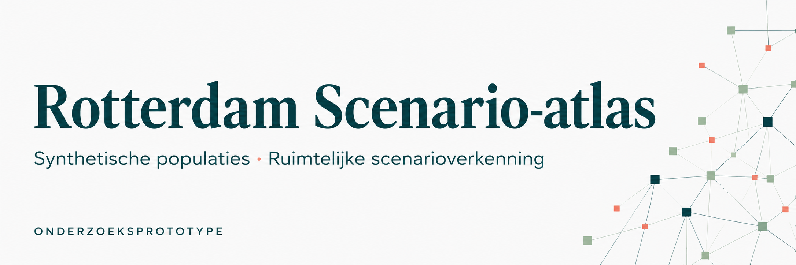
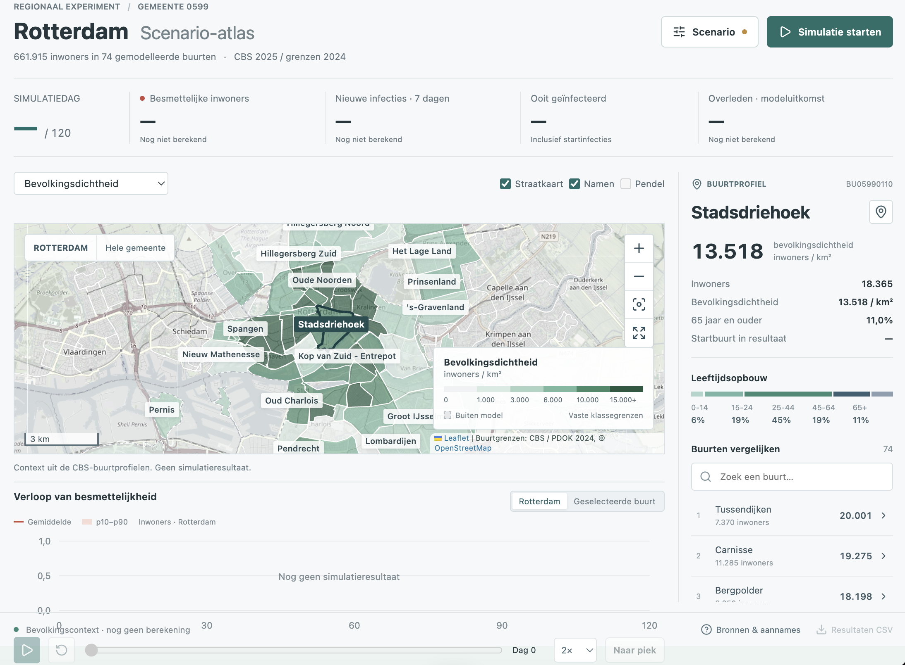

# PDPC-project

## Huidige hoofdversie: Synthetische Populatie Lab

De app opent met populatiegeneratie voor **Rotterdam, een provincie of heel Nederland**. Selecteer CBS-bronjaar **2022, 2023, 2024 of 2025**, kies kenmerken en download personen, huishoudens, lidmaatschappen en optionele activiteiten als gekoppelde CSV-tabellen in één ZIP. Elke export bevat broninvoer, methode, gegevenswoordenboek en kwaliteitscontroles. Het gekozen jaar bepaalt ook de gemeentelijke indeling; ontbrekende historische kenmerken blijven onbekend.

De Rotterdamse populatiekaart ondersteunt wijken, buurten en volledig scherm. De kaartgrenzen blijven expliciet een referentie uit 2024; rioolkoppelingen zijn schattingen op basis van fictieve woonlocaties. Oudere netwerken en dashboards staan achter het tandwiel rechtsboven.

[Live app](https://pandemic-prep.tjebbe-boersma.com/) · [Methode en beperkingen](onegov2-synthetic-data/docs/research-methods.md) · [Gegevenswoordenboek](onegov2-synthetic-data/docs/research-data-dictionary.md) · [Exports maken en publiceren](onegov2-synthetic-data/docs/research-release.md).

Grote gegenereerde ZIP-bestanden staan buiten Git. De live app biedt vaste 2024-downloads; de exporthandleiding bevat de opdrachten om deze lokaal opnieuw te maken. Translink-profielen zijn externe referenties. De NS-connector vereist een eigen API-abonnementssleutel buiten de browser en Git.

Alleen de onderstaande scenario-atlasbeschrijving betreft het eerdere model. Onafhankelijke populatievalidatie en epidemiologische kalibratie blijven nodig.



## Rotterdam Scenario-atlas

Een zelfstandige doorontwikkeling van het synthetische-pandemieproject voor verkennende gesprekken met PDPC en GGD Rotterdam-Rijnmond. Deze GitHub-versie bevat het gereedschap, de populatiegenerator, eerdere dashboards en benodigde brondata. De oorspronkelijke bestanden in de repository zijn behouden; de actuele versie staat op `main`, met behoud van de eerdere geschiedenis.

Grote gegenereerde populatie-CSV's, lokale presentaties, losse referentie-PDF's en tijdelijke bestanden zijn niet in deze publicatie opgenomen. Zie [output en controlesommen](gensynthpop-rotterdam/output/README.md). Dit heeft geen invloed op het draaien van de dashboards.

**Onderzoeksprototype, geen gevalideerd voorspelmodel.** Deze versie verbetert de kaart, bediening, transparantie en reproduceerbaarheid. Zij valideert of repareert niet automatisch de synthetische populatie of de epidemiologische aannames.

### Dashboard



*Bevolkingscontext vóór een simulatie; geen uitbraakresultaten. Kaart: CBS/PDOK en OpenStreetMap.*

### Starten

Dubbelklik op [run.command](run.command). Node.js en npm moeten beschikbaar zijn. De launcher opent de nieuwe Rotterdam-omgeving in de browser; laat het terminalvenster open tijdens gebruik.

Of vanuit deze map:

```sh
cd onegov2-synthetic-data
npm ci
npm run dev -- --host 127.0.0.1 --port 5187
```

Open http://127.0.0.1:5187. Als die poort bezet is, vermeldt Vite de gekozen volgende poort. Sluit de server af met Ctrl+C. De app rekent pas na **Simulatie starten** of **Berekenen**; schuifregelaars veranderen alleen een automatisch bewaard concept.

### Nieuwe werkruimte

- Echte CBS/PDOK-buurtgrenzen met straatkaart, schaalbalk, kaartlegenda, buurtlabels en selectie. Ook Hoek van Holland en het havengebied zijn via **Hele gemeente** te bekijken.
- Besmettelijke inwoners per 100.000, nieuwe infecties over zeven dagen per 100.000, cumulatieve infecties in procenten en bevolkingsdichtheid als context. Vaste kaartklassen houden verschillende dagen vergelijkbaar.
- Buurtprofiel met inwonertal, leeftijdsopbouw en zoekbare ranglijst. Gebieden buiten het model zijn expliciet onderscheiden van nul infecties.
- Gesynchroniseerde kaart, tijdlijn en resultaten. Gemiddelde en empirische p10-p90-band over meerdere epidemieruns. Een vorige berekening kan als referentiecurve blijven staan.
- Expliciete scenarioberekening in een aparte browserworker, voortgang, annuleren en behoud van oude resultaten. Geen herberekening bij het verslepen van een instelling.
- Import/export van scenario-JSON en CSV met buurtuitkomsten, eenheden, noemers, toegepaste instellingen, seeds en modelversie.
- De oorspronkelijke dashboards staan onder **Eerdere dashboards**. Hun oorspronkelijke modellen en bedieningspatronen zijn behouden.

### Data en model zijn verschillende onderdelen

De nieuwe kaart gebruikt 74 Rotterdamse buurten met minstens 250 inwoners: samen **661.915 inwoners**, ongeveer 98,4% van de 672.960 in de gemeenteregel. CBS-buurtprofielen uit 2025 zijn gekoppeld aan kaartgrenzen uit 2024. Er zijn geen ontbrekende modelbuurtcodes in die koppeling, maar inhoudelijke grenswijzigingen zijn daarmee niet uitgesloten.

De interactieve engine genereert **gewogen agents uit de buurtprofielen**. Standaard vertegenwoordigt een agent ongeveer 12 inwoners, met drie runs. De volledige GenSynthPop-CSV wordt **niet** door deze engine ingelezen en wordt apart van Git bewaard. Ook de aanwezige Google-referentiecode is niet de backend van deze Rotterdam-werkruimte.

Huishoudens, werk/school, pendel, evenementen en gemeenschap gebruiken de bestaande TypeScript-SEIRD-engine. Contactgewichten, naleving en risicoparameters bevatten aannames. Pendellijnen zijn synthetische modeltoewijzingen, geen gemeten reizigersstromen. De buurtkaart toont geen schijnbaar exacte woonadressen van agents.

De band beschrijft uitsluitend stochastische variatie bij vaste parameters en een vaste synthetische populatie. Zij is geen betrouwbaarheidsinterval voor werkelijke infecties. Een kleine hoeveelheid runs geeft grove percentielen; fijnere agentresolutie garandeert geen nauwkeuriger epidemiologie. Bevolkingsdichtheid is context, niet een afzonderlijk gekalibreerde transmissiedeterminant.

Zie [methoden en controlepunten](onegov2-synthetic-data/docs/pdpc-workspace.md) voor definities, beperkingen en de verificatie.

### Mappen

| Map / bestand | Inhoud |
|---|---|
| `onegov2-synthetic-data/` | Nieuwe app en bewaarde eerdere dashboards; ingebouwde buurtprofielen en geometrie in `src/data/` |
| `gensynthpop-rotterdam/` | Offline generator, broncaches, validatiescripts en verwijzingen naar gegenereerde output |
| `CSV-*`, `CSV_additional_data/` | Aangeleverde CBS-bronbestanden |
| `external/` | Gekopieerde externe referentiecode en bijbehorende licenties |
| `dataset-manifest.json` | Bestandsnamen, groottes en SHA-256-controlesommen van de meegepubliceerde databestanden |
| `dataset-manifest.full-local.json` | Controlesommen van de volledige lokale datasetkopie, inclusief grote niet-meegepubliceerde output |
| `METHODS_AND_REALISM.md` | Historische beoordeling uit het bronproject; geen nieuwe onafhankelijke validatie |

Virtuele omgevingen, geheime/lokale `.env`-bestanden, tijdelijke caches en distributiebundels zijn niet opgenomen. Installeer de app-afhankelijkheden vanuit het lockbestand met `npm ci`. Bronlicenties en documentatie zijn behouden. De Google-referentiecode in `external/agent-based-epidemic-sim` is overgenomen van commit `3db4858271780c41e282e717b2b115820f59ddc9` van [google-research/agent-based-epidemic-sim](https://github.com/google-research/agent-based-epidemic-sim).

### Controleren

```sh
node scripts/verify-datasets.mjs
cd onegov2-synthetic-data
npm run test:pdpc
npm run build
```

De eerste opdracht controleert de data tegen het meegeleverde manifest; de tests controleren onder andere noemers, populatiebehoud, seeds en incidentiepercentielen. Dit zijn technische consistentietests, geen wetenschappelijke validatie tegen onafhankelijke epidemiologische observaties.
